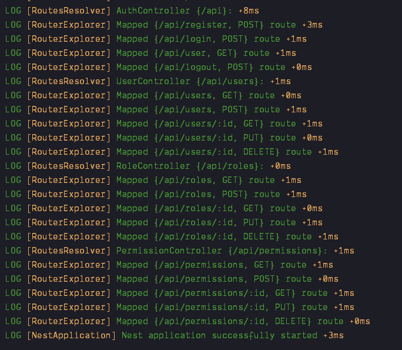

## NestJs Authentication 🛡️

NestJs Project containing full auth module, users module, roles modules, database integration, jwt, bcrypt, validations, guards, and permissions starter project.

### 📦 Package Installation

Install packages.
```bash
$ npm install
```

### 🚢 Docker

Install Docker desktop. Update docker-compose.yml base on your configurations and run the following command. 
```bash
$ docker-compose up -d
```


## 🚀 Running the app

```bash
# development
$ npm run start
# watch mode
$ npm run start:dev
# production mode
$ npm run start:prod
```

### 🧪 Test

```bash
# unit tests
$ npm run test
# e2e tests
$ npm run test:e2e
# test coverage
$ npm run test:cov
```
## 🌐 Routes and Endpoints

### 🔒 Auth
```bash
# Register
POST  http://localhost:3000/api/register
# Body
{
    "first_name": "test",
    "last_name": "name",
    "user_name": "testname",
    "email": "testname@email.com",
    "password": "password",
    "confirm_password": "password"
}
# Login
POST  http://localhost:3000/api/login
# Body
{
    "email": "testname@email.com",
    "password": "password"
}
# Authenticated user
GET   http://localhost:8000/api/user
# Logout current logged in user
POST  http://localhost:3000/api/logout
```

### 🙍‍♂️ User
```bash
# Get list of all users
GET   http://localhost:3000/api/users
# Get a user by id
GET   http://localhost:3000/api/users/:id
# Params:  key: id, value: 1
# Create new user
POST  http://localhost:3000/api/users
# Body
{
    "first_name": "test",
    "last_name": "name",
    "user_name": "testname",
    "email": "testname@email.com",
    "password": "password",
    "role_id": 2
}
# Update user by id
PUT   http://localhost:3000/api/users/:id
# Params:  key: id, value: 1
# Body
{
    "first_name": "new name",
    "user_name": "newname",
    "email": "newname@email.com",
    "role_id": 2
}
# Delete user by id
DELETE  http://localhost:3000/api/users/:id
# Params:  key: id, value: 1
```

### 👮 Roles
```bash
# Get list of all roles
Get       http://localhost:3000/api/roles
# Get a role by id
Get       http://localhost:3000/api/roles/:id
# Params:  key: id, value: 1
# Create new role
Post      http://localhost:3000/api/roles
# Body
{
    "name": "editor",
    "permissions": [1,2,3] # permission ids
}
# Update role by id
Put       http://localhost:3000/api/roles/:id
# Params:  key: id, value: 1
# Body
{
    "name": "subscriber",
    "permissions": [1,2,3,4]
}
# Delete role by id
Delete    http://localhost:3000/api/roles/:id
# Params:  key: id, value: 1
```

### 🔑 Permissions
```bash
# Get list of all permissions
Get       http://localhost:3000/api/permissions
# Get a permission by id
Get       http://localhost:3000/api/permissions/:id
# Params:  key: id, value: 1
# Create new permission
Post      http://localhost:3000/api/permissions
# Body
{
    "name": "view_users"
}
# Update permission by id
Put       http://localhost:3000/api/permissions/:id
# Params:  key: id, value: 1
# Body
{
    "name": "edit_users"
}
# Delete permission by id
Delete    http://localhost:3000/api/permissions/:id
# Params:  key: id, value: 1
```

### License

This project like Nest is [MIT licensed](LICENSE).
